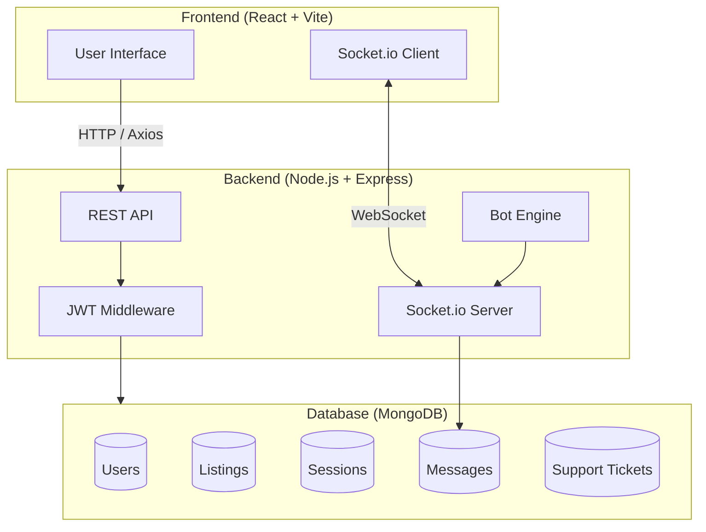
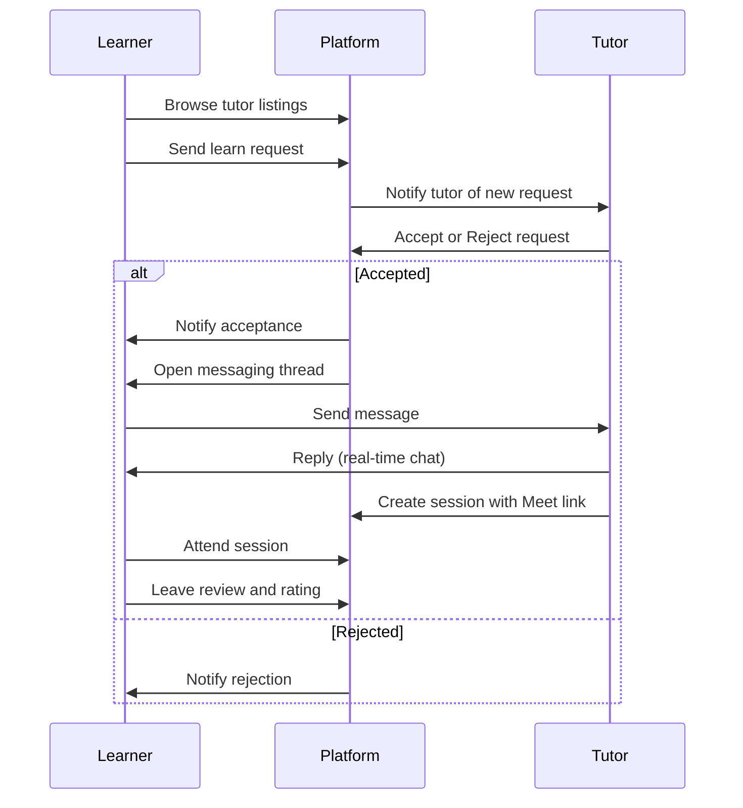
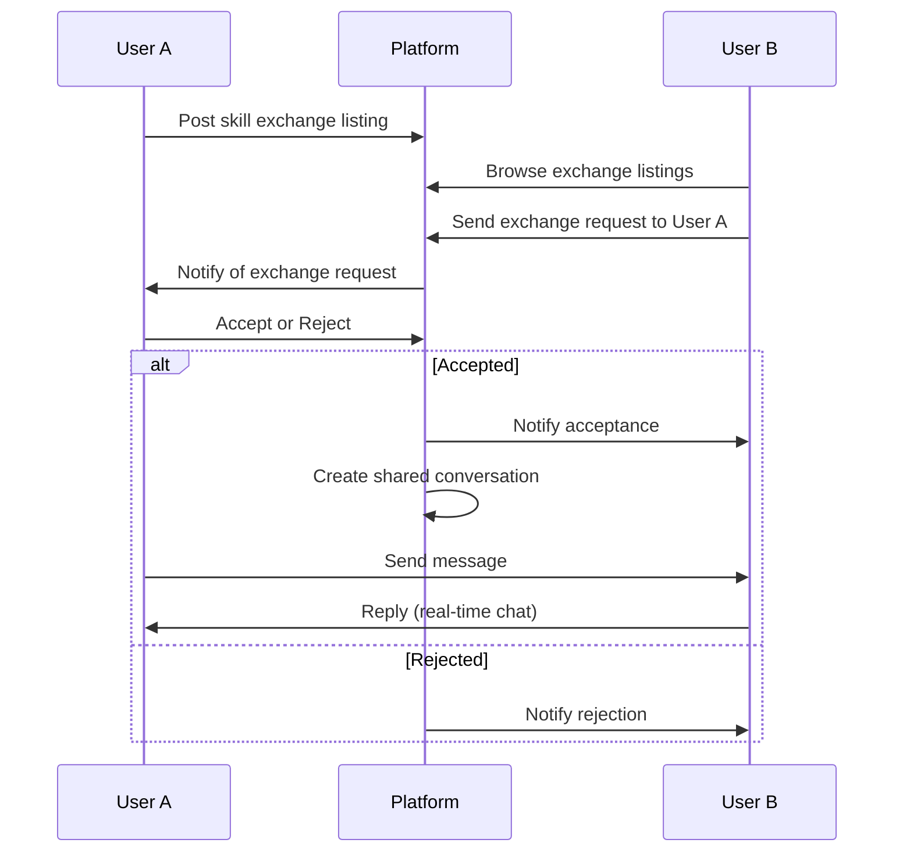
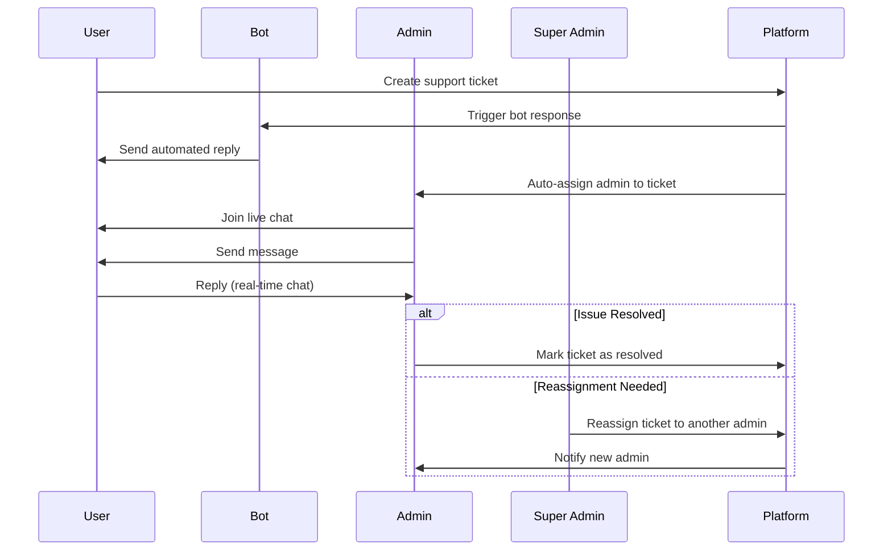
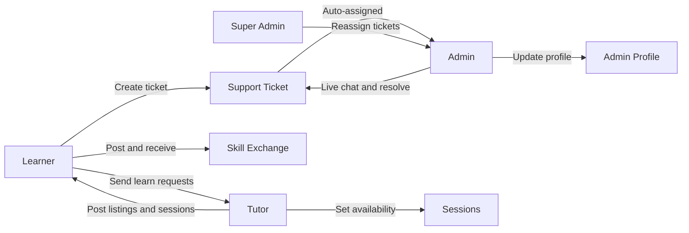

# PeerLearn 🎓

> A full-stack skill exchange and peer tutoring platform that connects learners and tutors in a collaborative, real-time environment.

[](https://peerlearn-zeta.vercel.app)


---

## 📖 About

PeerLearn is a skill exchange platform where tutors can post skills they can teach and learners can send requests based on their needs. Learners can also post skills they want to learn, and tutors can respond if they can teach that skill — creating a two-way collaborative learning ecosystem.

---

## 🗺️ Diagrams

### System Architecture



---

### 📬 Learn Request Flow



---

### 🔄 Skill Exchange Flow



---

### 🎫 Support Ticket Flow



---

### 👥 User Roles Overview



---

## ✨ Features

### 🔐 Authentication
- User registration and login with JWT-based authentication
- Protected routes and persistent login sessions

### 📋 Tutor Listings
- Tutors can create listings for skills they can teach
- Each listing includes: skill name, description, level, learning mode, and price

### 📬 Learn Requests
- Learners can send requests directly to tutors
- Tutors can accept or reject requests
- Request-specific messaging between tutor and learner

### 🔄 Skill Exchange
- Users can post skills they want to exchange
- Other users can send exchange requests
- Accepted exchanges open a dedicated conversation between users

### 💬 Real-Time Messaging
- Live chat between tutors and learners via Socket.io
- Supports session-based, request-based, and exchange-based messaging
- Read receipts and file attachment support

### 📅 Session Scheduling
- Tutors can create and manage sessions within their set availability
- Google Meet link integration for online sessions
- Supports rescheduling, cancellation, and session completion tracking

### ⭐ Reviews & Ratings
- Learners can leave reviews after completed sessions
- Tutors receive an average rating, rating count, and a badge level:
  - 🟢 Beginner → 🔵 Trusted → 🟡 Excellent → 🏆 Top Tutor

### 🔔 Notifications
- Real-time notifications for: new requests, accepted/rejected requests, new messages, session creation, and session updates

### 🗓️ Availability Management
- Tutors can set weekly availability slots
- Sessions can only be scheduled within defined available time windows

### 🎫 Support Tickets (User Side)
- Users can report platform issues by creating a support ticket
- Each ticket opens a live chat session with an assigned admin
- Bot messages are enabled to assist users before an admin joins

### 🛡️ Admin Panel
- Admins can view all incoming support tickets from users
- Admins can live chat with users directly within a ticket
- Bot messaging is enabled to handle common queries automatically
- Admins can mark tickets as resolved once the issue is addressed
- Admins can update their own profile details including name, ID, and avatar

### 👑 Super Admin
- Super admins can view all tickets and their auto-assigned admins
- Super admins can reassign tickets from one admin to another as needed

---

## 🛠️ Tech Stack

| Layer | Technologies |
|---|---|
| **Frontend** | React, Vite, SCSS, React Router, Axios, Socket.io Client |
| **Backend** | Node.js, Express.js, MongoDB, Mongoose, JWT, Socket.io |

---

## 📁 Folder Structure

```
peerlearn/
│
├── backend/
│   ├── config/          # DB and environment config
│   ├── controllers/     # Route handler logic
│   ├── middleware/      # Auth and validation middleware
│   ├── models/          # Mongoose schemas
│   ├── routes/          # Express route definitions
│   ├── utils/           # Helper functions
│   ├── server.js        # Entry point
│   └── package.json
│
├── frontend/
│   ├── src/             # React components, pages, hooks
│   ├── public/          # Static assets
│   ├── package.json
│   └── vite.config.js
│
├── package.json
└── README.md
```

---

## 🚀 Getting Started

### Prerequisites

- Node.js v18+
- MongoDB (local or Atlas)
- npm or yarn

### Installation

1. **Clone the repository**

```bash
git clone https://github.com/fahimroy22/peerlearn.git
cd peerlearn
```

2. **Set up the backend**

```bash
cd backend
npm install
```

Create a `.env` file in the `backend/` directory:

```env
PORT=5000
MONGO_URI=your_mongodb_connection_string
JWT_SECRET=your_jwt_secret
CLIENT_URL=http://localhost:5173
```

3. **Set up the frontend**

```bash
cd ../frontend
npm install
```

Create a `.env` file in the `frontend/` directory:

```env
VITE_API_URL=http://localhost:5000
```

### Running the App

**Start the backend:**

```bash
cd backend
npm run dev
```

**Start the frontend (in a separate terminal):**

```bash
cd frontend
npm run dev
```

The app will be available at `http://localhost:5173`.

---

## 🌐 Live Demo

👉 [https://peerlearn-zeta.vercel.app](https://peerlearn-zeta.vercel.app)

---

## 🤝 Contributing

Contributions are welcome! Feel free to open an issue or submit a pull request.

1. Fork the repository
2. Create a feature branch: `git checkout -b feature/your-feature`
3. Commit your changes: `git commit -m 'Add your feature'`
4. Push to the branch: `git push origin feature/your-feature`
5. Open a Pull Request

---

## 📄 License

This project is open source. Feel free to use and build upon it.

---

<p align="center">Made with ❤️ by <a href="https://github.com/fahimroy22">fahimroy22</a></p>
